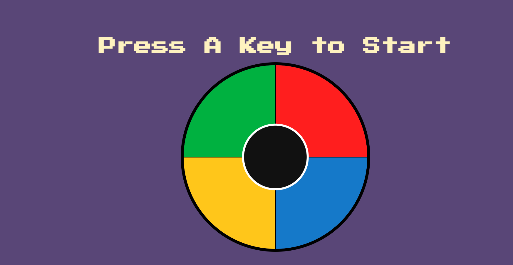

# 🎮 Simon Game

A classic **Simon Memory Game** built using **HTML, CSS, JavaScript, and jQuery**.

The game challenges your memory by generating a random sequence of colors. The player must remember and repeat the sequence correctly. As the level increases, the sequence becomes longer and more difficult.

## 📸 Screenshot



## ✨ Features

- 🎲 Random sequence generation
- 🎵 Sound effects for each color button
- 💡 Interactive button animations
- 📊 Dynamic level tracking
- ❌ Game over detection
- 🔄 Restart functionality
- ⌨️ Keyboard support
- 📱 Mobile touch support

## 🛠️ Technologies Used

- **HTML5** – Structure of the game
- **CSS3** – Styling and animations
- **JavaScript** – Game logic and functionality
- **jQuery** – DOM manipulation and event handling

## 🎯 How to Play

1. Press any key on the keyboard or tap the center area to start the game.
2. Watch the color sequence generated by Simon.
3. Click the buttons in the same order as shown.
4. Each correct sequence takes you to the next level.
5. Pressing the wrong button ends the game.

## 📁 Project Structure

```text
Simon_game/
│
├── index.html
├── styles.css
├── game.js
│
└── sounds/
    ├── blue.mp3
    ├── green.mp3
    ├── red.mp3
    ├── yellow.mp3
    └── wrong.mp3
```

## 🚀 Installation & Setup

Clone this repository:

```bash
git clone https://github.com/aditya6903/Simon_game.git
```

Navigate to the project folder:

```bash
cd Simon_game
```

Open `index.html` in your browser to start playing.

## 🔮 Future Improvements

- Add high score tracking using Local Storage
- Add difficulty levels
- Add pause/resume functionality
- Add sound control option
- Improve animations and UI design

## 👨‍💻 Author

**Aditya Gharat**

GitHub:  
https://github.com/aditya6903
